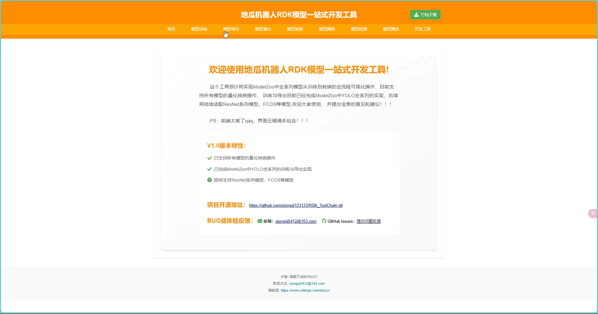
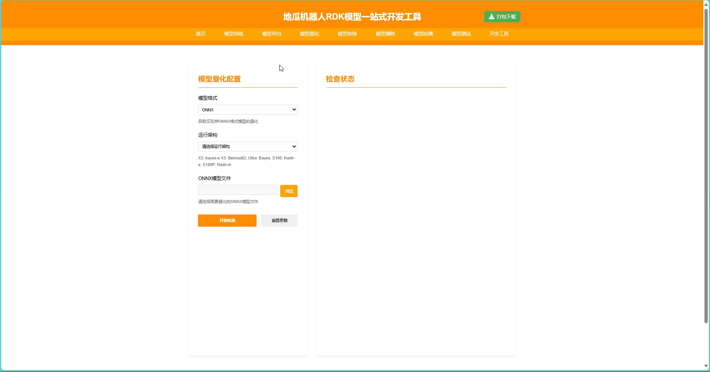
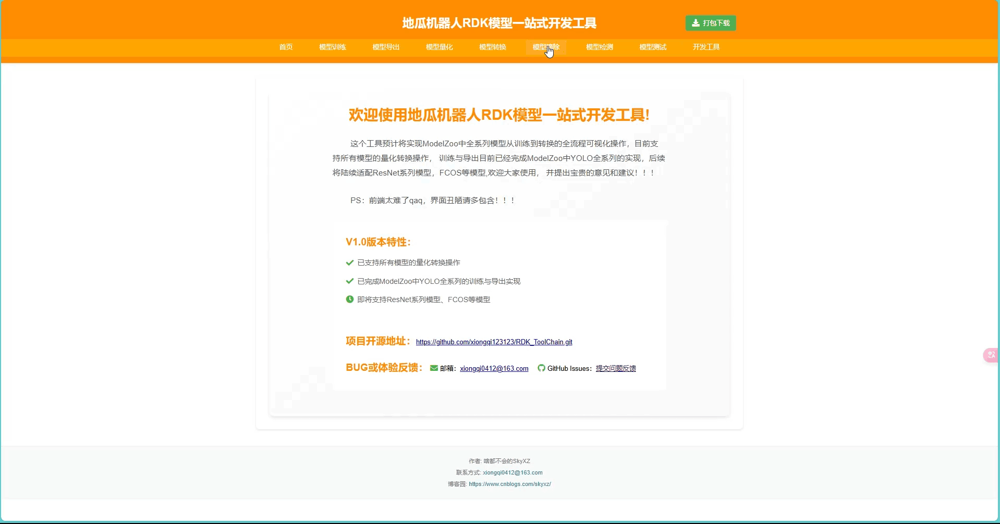

# (伪)RDK可视化模型转换工具

> 作者：SkyXZ
>
> CSDN：[SkyXZ～-CSDN博客](https://blog.csdn.net/xiongqi123123?spm=1000.2115.3001.5343)
>
> 博客园：[SkyXZ - 博客园](https://www.cnblogs.com/SkyXZ)

[English](README.md) | [简体中文](README_cn.md)  
&nbsp;&nbsp;&nbsp;&nbsp;&nbsp;&nbsp;&nbsp;&nbsp;之前在使用的RDK X3的时候，吴诺老师@wunuo发布了[新一代量化转换工具链使用教程](https://developer.d-robotics.cc/forumDetail/219287410792732160?key=1)，这个工具真的非常的方便，能非常快速的完成X3上模型的量化，唯一的缺点便是不支持X5，于是我便想着仿照老师的X3可视化工具链来弄一个适配X5的可视化量化转换工具链，我的初步构想便是这个可视化工具链能够逐步适配地瓜ModelZoo里的所有模型实现一站式从模型的训练到模型的转换最后到部署，使之能够更加轻松便捷的服务新拿到RDK的同学们，<font color="orange">于是在经过一段时间的努力后，我的工具链初版完成啦！</font>，可遗憾的是目前模型训练和模型导出部分仅支持YOLO的系列，其他的模型诸如ResNet、FCOS则暂时不支持从训练到转换，但是由于模型的量化和转化部分的自由度非常的高，现在应该是能覆盖绝大多数模型的转换了

&nbsp;&nbsp;&nbsp;&nbsp;&nbsp;&nbsp;&nbsp;&nbsp;现在这个版本非常的粗糙，本来都有点不敢发出来的，希望大家能够多多提出意见帮助这个项目改进！（qaq：JS真的太难了）

- 项目地址：https://github.com/xiongqi123123/RDK_ToolChain.git （求求Star~仓库中仅有前后端代码没有修改过的模型及权重文件，完整版请从网盘下载）
- 项目网盘：https://pan.baidu.com/s/1fz_DueWNr3uKDLO7KkNwZw?pwd=7jy3

### **使用方法：**

1. **Docker使用（推荐）：**

```bash
# step 1 拉取docker镜像（阿里云仓库）
docker pull crpi-0uog49363mcubexr.cn-hangzhou.personal.cr.aliyuncs.com/skyxz/rdk_toolchain:v1.3
# step 2 创建文件夹映射
mkdir ~/dataset
export dataset_path=~/dataset
# Run-Method-1 临时创建容器（自行修改--shm-size配置）
docker run -it --rm --gpus all --shm-size=32g --ipc=host -e PYTORCH_CUDA_ALLOC_CONF=max_split_size_mb:128 -e CUDA_LAUNCH_BLOCKING=1 -p 5000:5000 -p 8080:8080 -v "$dataset_path":/data rdk_toolchain:v1.3
# Run-Method-2 永久创建容器（自行修改--shm-size配置）
docker run -it --rm --gpus all --shm-size={你的内存大小例如：32g} --ipc=host -e PYTORCH_CUDA_ALLOC_CONF=max_split_size_mb:128 -e CUDA_LAUNCH_BLOCKING=1 -p 5000:5000 -p 8080:8080 -v "$dataset_path":/data rdk_toolchain:v1.3
```

2. **手动构建docker镜像：**

```bash
# step 1 ：从百度云下载源码（仓库中仅有前端后端实现）
https://pan.baidu.com/s/1fz_DueWNr3uKDLO7KkNwZw?pwd=7jy3
# step 2 解压并进入项目目录
# step 3 构建docker
docker build -t rdk_toolchain .
# step 4 创建文件夹映射
mkdir ~/dataset
export dataset_path=~/dataset
# Run-Method-1 临时创建容器（自行修改--shm-size配置）
docker run -it --rm --gpus all --shm-size=32g --ipc=host -e PYTORCH_CUDA_ALLOC_CONF=max_split_size_mb:128 -e CUDA_LAUNCH_BLOCKING=1 -p 5000:5000 -p 8080:8080 -v "$dataset_path":/data rdk_toolchain:v1.3
# Run-Method-2 永久创建容器（自行修改--shm-size配置）
docker run -it --rm --gpus all --shm-size={你的内存大小例如：32g} --ipc=host -e PYTORCH_CUDA_ALLOC_CONF=max_split_size_mb:128 -e CUDA_LAUNCH_BLOCKING=1 -p 5000:5000 -p 8080:8080 -v "$dataset_path":/data rdk_toolchain:v1.3
```

3. **直接下载源码使用：**

```bash
# step 1 ：从百度云下载源码（仓库中仅有前端后端实现）
https://pan.baidu.com/s/1fz_DueWNr3uKDLO7KkNwZw?pwd=7jy3
# step 2 : 安装依赖
pip3 install -r requirements_docker.txt
# step 3 ：运行脚本即可
bash start_services.sh
```

### **注意事项：**

1. 当前页面的任务正在进行的时候请不要切换至其他页面！切至其他页面后再切回本页面无法恢复原先内容！也无法结束进行中的进程了！
2. 当停止某项操作时（如停止训练）有时停止按钮可能会卡住无反应，这不是卡死了！这是后台正在尝试杀死进程中，几秒后再次点击停止即可退出！
3. 当遇到无法结束进程或是在任务进行中切换至其他页面时请停止Docker以结束后台正在运行中的进程！
4. 部分日志输出为红色不一定是报错！进程是否因为报错结束请以训练状态标志为准！
5. <font color="red">除了模型导出的onnx会放在原pt模型路径下之外，其他所有运行的结果将保存在/app/logs下</font>

### **版本介绍：**

#### V1.0:

1. 已支持所有模型的量化转换操作
2. 已完成ModelZoo中YOLO全系列的训练与导出实现
3. 即将支持ResNet系列模型、FCOS等模型（TODO V2.0）
4. 即将实现PC端转换后模型推理检查（TODO V2.0）

### **地瓜机器人RDK模型一站式开发工具功能展示：**

- 工具总览：


- 模型训练：


- 模型导出



- 模型量化检查



- 模型转换


- 反量化节点摘除



- 模型输入输出情况及可视化检查


